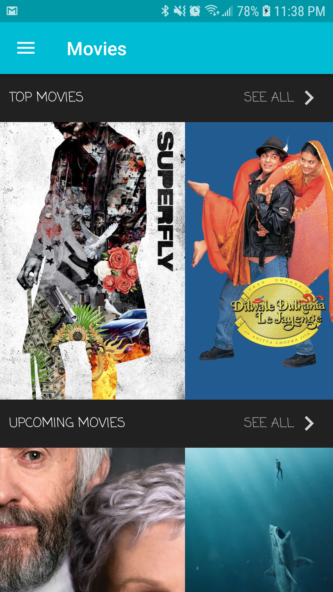
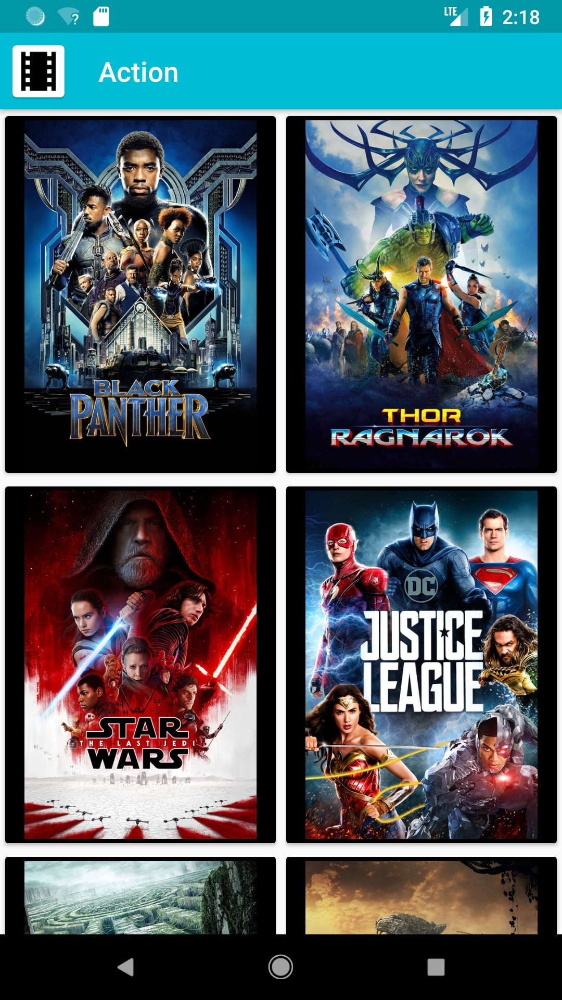
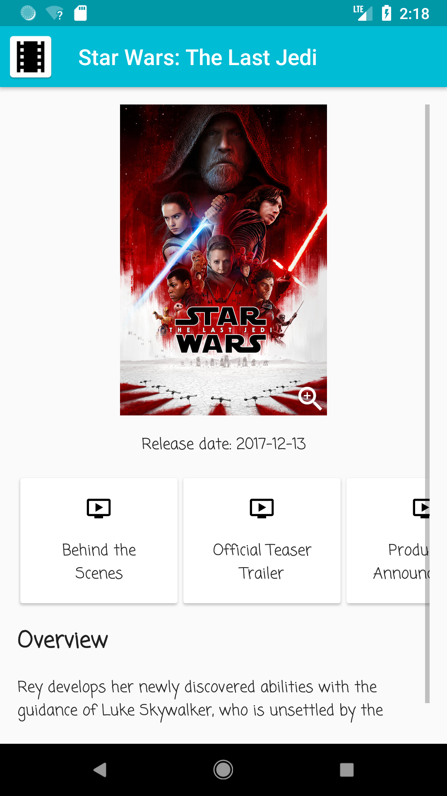

# MovieList

## Overview

This is a movie application that shows all movies from the MovieDb.

This application uses the https://www.themoviedb.org/ api to fetch the
movie information.

This application is pretty much my playground to test new Android
libraries, architectural patterns, best practices, etc.

This application is not meant to be used as a guide to developers of
any kind, as to how your applications should be built.

## Screenshots
|  |  | 
|:---|:---|:---|